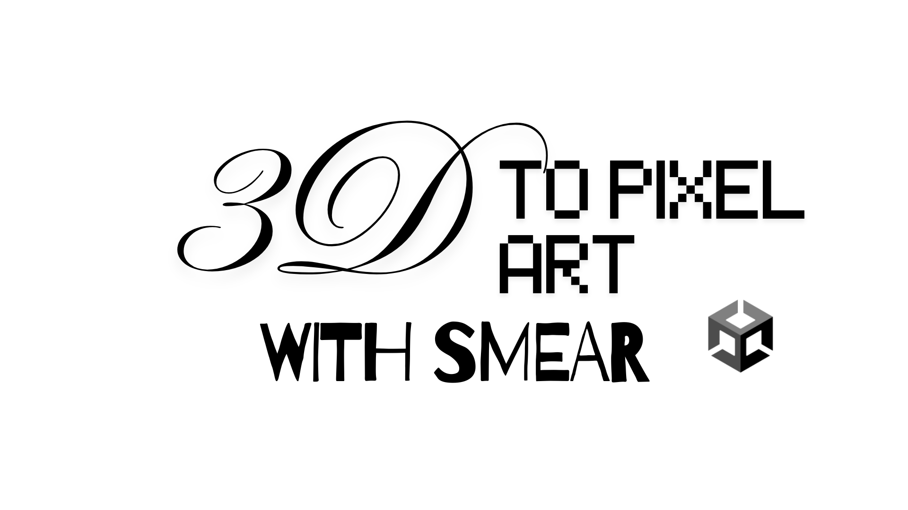

<div align="center">
  

  <br/>
  <br/>

  
  
  
  

  <br/>

  **Drop in a 3D character and an animation clip. Get back pixel art sprite sheets with smear frames already baked in.**

</div>

---

This is a Unity editor package. You give it a rigged 3D character and an animation clip. It measures how fast each part of the character is moving, generates smear geometry on the fast-moving parts, renders everything at high resolution, then converts those frames into pixel art and exports a ready-to-use sprite sheet with animation clip and prefab.

**Smear frames** are those stretched distortions you see on fast attacks in 2D fighting games — normally drawn by hand for every move. This generates them automatically from the 3D mesh.

---

## How it works

Two offline steps. Disk is the handoff between them — you can run both in one click or in separate sessions.

```
[ 3D character + animation clip ]
            |
            |  Step 1 — Smear Bake
            |
            |  measure bone and vertex velocity
            |  build smear geometry (stretch / ghost copies / motion lines)
            |  render at high resolution
            |
            v
   character_highres.png  +  character_highres.json
            |
            |  Step 2 — Pixel Art Conversion
            |
            |  downscale while preserving smear shapes
            |  build a consistent color palette across all frames
            |  pack into a sprite sheet
            |
            v
   character_pixel.png  +  character_pixel.json
   AnimationClip  +  AnimatorController  +  Prefab
```

---

## Install

### From GitHub (recommended)

Open **Window > Package Manager**, click **+**, choose **Add package from git URL**, and enter:

```
https://github.com/Loxenary/3D-to-Pixel-Art-Smear-Generator.git#release
```

Or add it to `Packages/manifest.json` directly:

```json
"com.davis.smear-generator": "https://github.com/Loxenary/3D-to-Pixel-Art-Smear-Generator.git#release"
```

This tracks the `release` branch. Pin to a specific version with a tag like `#v0.2.3`.

### From a local clone

```json
"com.davis.smear-generator": "file:/absolute/path/to/3D-to-Pixel-Art-Smear-Generator"
```

---

## Requirements

| | |
|---|---|
| Unity | 6000.3 or newer (verified on 6000.3.6f1) |
| Character | must have a `SkinnedMeshRenderer` |
| Animation | must be compatible with the character |

No third-party package dependencies. Tests use Unity Test Framework 1.6.0.

---

## Quick start

1. Install the package.
2. Open **Smear Generator > Open Smear Generator**.
3. Set mode to **Full**.
4. Assign your character model and animation clip.
5. Click **Preview animation** — check that the pose and textures look right.
6. Click **Run pipeline**.
7. Find your sprite sheet, animation clip, and prefab in `Assets/SmearGenerator.Generated/`.

---

## Pipeline modes

| Mode | What it does |
|---|---|
| **Full** | Runs both steps end-to-end. Use this for a normal bake. |
| **Smear Bake** | Step 1 only — renders high-res frames. Use when you want to tune smear settings before committing to pixel conversion. |
| **Pixel Art** | Step 2 only — loads a previous high-res capture and re-runs pixelization. Use when tweaking palette or resolution without re-rendering the 3D scene. |

---

## What a bake produces

```
Assets/SmearGenerator.Generated/Output/<name>/
├── <name>.png              sprite sheet
├── animation.json          frame rects, timing, pivot, smear metadata
├── package.json            portable package descriptor
├── <name>_2d.anim          Unity AnimationClip
├── <name>_2d.controller    AnimatorController
└── <name>_2d.prefab        prefab with SpriteRenderer + Animator
```

---

## Tools

| Menu item | When to use it |
|---|---|
| **Open Smear Generator** | Main workflow — preview and bake. |
| **FBX Avatar Setup** | Character and clip come from different FBX files (e.g. Mixamo body + separate animation). Run this first, then go back to the main window. |
| **FBX Texture Fixer** | Character imports as solid white. Extracts embedded textures from the FBX into the `.fbm` folder Unity expects. |
| **Utilities > Import Exported Pixel Art Animation** | Moving a generated animation to another Unity project. Do not drag the `.prefab` directly — use this importer so Unity rebuilds asset references. |

---

## Configuration

### Pixel settings

| Control | What it does |
|---|---|
| Output resolution | Final pixel-art frame size. 64px is a good starting point. |
| Capture resolution | Internal render size before downscaling. Higher = more detail, slower bake. |
| Palette size | Max colors when auto-generating a palette. Ignored when a palette LUT is assigned. |
| Outline | Draws a solid silhouette outline around the character. |
| Outline color | Color of that outline. Dark desaturated colors blend with most palettes. |
| Pixels per unit | Unity units per pixel. Match this to your game's pixel density. |
| Loop playback | Whether the generated clip loops. Turn off for one-shot actions like attacks. |
| Pivot normalized | Sprite anchor point. Bottom-center works for most characters. |
| Save high-res to disk | Keep the raw 3D render so you can re-run just the pixel step later. |

### Post-process / palette

| Control | What it does |
|---|---|
| Post process config | Optional asset for palette quantization, flicker suppression, and downscale quality. Leave empty for defaults. |
| Palette LUT | Lock output to a fixed artist palette. Leave empty to auto-generate. |
| Edge refine passes | How many times the downscaler sharpens edges before sampling. Default 5. Higher = crisper outlines, slower bake. |
| Flicker suppress | Minimum color change between frames before a pixel updates. Reduces inter-frame noise. |
| Reuse palette across frames | Build the palette once from a seed frame, apply to all. Faster and more consistent. Disable to regenerate per frame. |

### Smear settings

| Control | What it does |
|---|---|
| Target FPS | Samples captured per second. |
| Playback speed | Sampling speed. Faster = stronger measured motion = stronger smears. |
| Elongated | Stretches moving geometry along its path. Good for fast limbs. |
| Multiples | Adds repeated silhouettes along the movement path. |
| Motion lines | Adds line geometry from the trajectory. Length follows velocity. |
| Smear strength / thresholds | Size of displacement and minimum motion before each type activates. Change one at a time, then rebake. |

---

## Moving output to another project

**On the source project:**

1. After a successful bake, open **Results**.
2. Click **Export Folder** and save somewhere outside the Unity project.
3. Copy that folder to the destination machine.

**On the destination project:**

1. Install this package.
2. Open **Smear Generator > Utilities > Import Exported Pixel Art Animation**.
3. Select the exported folder.
4. Use the rebuilt prefab from `Assets/SmearGenerator.Generated/ImportedPackages/<name>/`.

The importer uses the PNG and JSON as the source of truth. Do not drag the `.prefab` directly into Assets — the sprite references will be missing.

---

## Troubleshooting

**Character is solid white** — Open FBX Texture Fixer, fix the FBX, preview again.

**Character or animation is distorted** — Open FBX Avatar Setup. Make sure both the character and clip FBX have valid humanoid avatars.

**Imported prefab has missing sprites** — Delete the broken import and run the importer again from the exported folder. Do not copy the `.prefab` by itself.

**Pixel Art mode has no input** — It needs a high-res PNG + JSON from a previous Smear Bake or Full run. Select those files first.

**Package update does not appear** — Manually update the git tag in `Packages/manifest.json` and commit both `manifest.json` and `packages-lock.json`.

---

## Package layout

```
Editor/          windows, pipeline stages, import/export tools
Runtime/         components used by generated prefabs
Shaders/         capture, ghost, and motion-line shaders
Tests/Editor/    EditMode tests
Documentation~/  full documentation
package.json     UPM manifest
```

See [Dependencies](Documentation~/dependencies.md) for the full dependency list.
